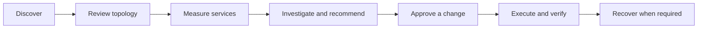

# Campus Network Operations

Discovery, inventory review and controlled maintenance for mixed-generation networks.

Campus Network Operations combines topology evidence, service measurements and configuration review in a single operator workflow. It integrates existing monitoring with reviewed inventory and typed maintenance plans, with platform-specific adapters for legacy equipment.

**Status: in development.** Discovery and inventory review are implemented. Reviewed AI diagnosis and bounded provider rollover are implemented; live provider qualification, device enrollment, broader measurement coverage and production execution remain in progress.

## Capabilities

- **Scoped discovery:** bounded traversal from infrastructure seeds, with source timestamps, identity conflict detection and topology corrections.
- **Reviewed inventory:** draft devices and connections, explicit acceptance, and publication to NetBox through its API.
- **Device access:** SSH key preparation, host fingerprint review and platform-specific read adapters.
- **Measurements:** verified local sources, reviewed schedules, ICMP loss and rolling latency, HTTP/HTTPS and SSH response checks, and incident correlation across independent observations.
- **AI diagnosis:** reviewed evidence packets, cited assessments, explicit provider routes and bounded rollover through OmniRoute.
- **Configuration review:** rules for comparing observed settings with accepted network intent.
- **Controlled maintenance:** typed plans, revision-bound approval, execution policy and an interruption-aware runner prototype.

Detailed implementation status and component responsibilities are documented in [Architecture](docs/ARCHITECTURE.md). Planned work is tracked in the [Roadmap](docs/ROADMAP.md).

## Workflow



The complete workflow is the development target; current support varies by component and device adapter.

## Development setup

### Prerequisites

- Linux with a systemd user session
- Python 3.12 or later and uv
- Node.js and npm
- PostgreSQL 18 binaries
- Docker with Compose

Python and frontend dependencies are recorded in `uv.lock` and `ui/package-lock.json`. Container images are defined in `deploy/compose.yaml`.

```sh
uv sync --locked --group dev
npm --prefix ui ci
npm --prefix ui run build

.venv/bin/python deploy/local_database.py start
.venv/bin/python manage.py migrate
.venv/bin/python deploy/manage_platform.py up
.venv/bin/python deploy/manage_platform.py bootstrap-inventory
.venv/bin/python manage.py setup-access
.venv/bin/python deploy/install_services.py
```

The database helper currently expects PostgreSQL binaries under `/usr/lib/postgresql/18/bin`. The inventory bootstrap runs after NetBox finishes starting and creates its integration account.

The application is available at `http://127.0.0.1:8875/`, with NetBox at `http://127.0.0.1:8876/`. Initial account creation uses the setup token generated by `manage.py setup-access` in `.state/secrets/setup_token`.

The development services are `campus-next-api`, `campus-next-observe` and `campus-next-inventory`. Production installation and the isolated execution service are roadmap items.

## Tests

```sh
.venv/bin/pytest -q
.venv/bin/ruff check backend deploy tests
npm --prefix ui run build
npm --prefix ui exec -- playwright install chromium
npm --prefix ui test
```

Database tests use isolated schemas in the development PostgreSQL instance. The optional NetBox contract test creates a temporary database and container:

```sh
RUN_NETBOX_CONTRACT=1 .venv/bin/pytest -q tests/test_netbox_contract.py
```

The Temporal measurement contract uses an isolated task queue and database schema, with real source verification and loopback ICMP:

```sh
RUN_TEMPORAL_CONTRACT=1 .venv/bin/pytest -q tests/test_temporal_measurements.py
```

Browser tests use explicit API fixtures. The backend workflow tests exercise real PostgreSQL transactions; the optional contracts exercise the external services.

## Repository layout

| Directory | Contents |
|---|---|
| `backend/` | API, domain models, discovery, integrations, checks and workflows |
| `ui/` | React and TypeScript interface |
| `deploy/` | Development environment and service configuration |
| `policies/` | OPA execution policy |
| `tests/` | Unit, behavior and integration tests |
| `docs/` | Architecture, roadmap and technical specifications |

## Documentation

- [Architecture and implementation status](docs/ARCHITECTURE.md)
- [Roadmap](docs/ROADMAP.md)
- [Health checks](docs/HEALTH-CHECKS.md)
- [Configuring measurements](docs/MEASUREMENTS.md)
- [AI diagnosis and provider setup](docs/DIAGNOSIS.md)
- [Configuration review](docs/CONFIGURATION-REVIEW.md)
- [Execution lifecycle](docs/EXECUTION.md)
- [Acceptance criteria](docs/ACCEPTANCE.md)
