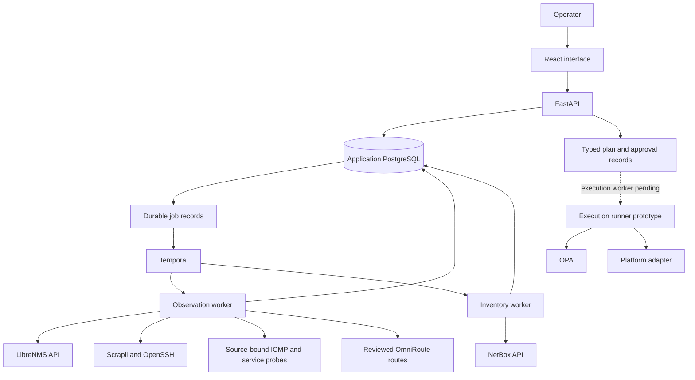
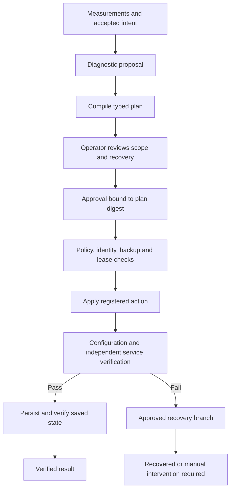

# Architecture

Campus Network Operations separates observed infrastructure, accepted network intent and approved maintenance actions. The application combines monitoring evidence with direct device reads, keeps uncertain identities reviewable, and uses typed plans to translate a finding into a controlled change.

## Components

| Component | Technology | Responsibility | Implementation |
|---|---|---|---|
| Operator interface | React, TypeScript, Vite | Topology, evidence, review and operational history | Implemented; remaining end-to-end flows in development |
| Interface primitives | Radix Dialog, Lucide, Cytoscape | Accessible dialogs, icons and topology rendering | Integrated |
| Application API | FastAPI, Pydantic | Sessions, validated requests, revisions and approvals | Implemented |
| Operational state | PostgreSQL, Psycopg | Observations, drafts, incidents, jobs, approvals and audit | Implemented |
| Workflow engine | Temporal | Durable observation and inventory jobs | Integrated; execution worker pending |
| Execution policy | OPA | Evaluation of execution preconditions | Policy and client implemented |
| Device transport | Scrapli, OpenSSH | Key-based reads and platform-specific actions | Partial platform coverage |
| Monitoring integration | LibreNMS API | Device, neighbor and port observations | Connector implemented |
| Intended inventory | NetBox API | Accepted devices and applicable physical connections | Publication and contract tests implemented |
| Probe collection | Linux ping, Python sockets and TLS | Verified local sources, ICMP distributions and service responses | Reviewed scheduling and H01–H04 collection implemented |
| AI gateway | OmniRoute | Reviewed evidence, explicit provider routes and bounded rollover | Application integration implemented; gateway/account qualification pending |
| Configuration history | Oxidized | Supported platform configuration collection | Planned |
| Directed/load testing | Device-native probes, fping, iperf3 | Source-specific paths and controlled offered load | Planned |
| Deployment | Docker Compose, systemd | Dependency services and process supervision | Development environment implemented |

Nornir is present in the dependency manifest but has no runtime integration. Its role in bounded device dispatch remains under evaluation.

## Current data flow

The development services currently share an OS account and application database privileges. Dedicated execution identity, scoped credential delivery and enforced target egress are planned production components.

## Data ownership

The application owns collected evidence, draft topology, operational policies, incidents, recommendations and execution history. NetBox owns accepted intended inventory where its data model applies.

Discovery produces draft records. Publication starts from an explicit review of selected device and connection revisions. NetBox write acknowledgements and readback establish publication success; partial external writes remain available for reconciliation.

Each observation retains its source and observation time. Retrieval time is stored separately. A refreshed API response can therefore contain old measurements without becoming a new observation.

Connections have explicit types: advertised neighbor, logical route, service dependency, confirmed physical link or proposed relationship. Physical links require appropriate endpoint evidence; an IP address or neighbor advertisement alone is insufficient.

## Discovery and access

Discovery begins with infrastructure seeds, allowed management prefixes and configured access sources. Traversal is bounded by scope, depth and node limits. Missing access, conflicting identities and unsupported parsers become visible coverage gaps.

Excluded identities retain their history. Discovery skips their known addresses before device access and suppresses traversal when an excluded serial alias is recognized after a read. Exclusions made during collection cannot be overwritten by the arriving observation. The Devices view provides restoration to draft inventory with an operator reason; measurement schedules remain paused until inventory and policies are reviewed again.

Direct access uses SSH keys and reviewed host fingerprints. Failed authentication creates a hold that requires review before another attempt. Key preparation creates a public identity and a private file reference; device account enrollment is a separate workflow.

Current adapter coverage:

| Platform | Reads | Changes |
|---|---|---|
| Cisco IOS-XE | Identity and CDP/LLDP parsing | NTP/syslog destination prototype; qualification pending |
| D-Link | Identity parsing | Pending |
| Linux / FreeBSD | Basic operating-system identification | Pending |
| pfSense | Identification through monitoring evidence | Dedicated collection and maintenance integration pending |

Support is determined by operation and firmware. Existing CLI and monitoring interfaces can provide useful coverage without requiring a modern management API or an agent on every device. Unsupported account, privilege or rollback capabilities remain explicit platform limitations.

## Measurements and recommendations

The [health-check catalogue](HEALTH-CHECKS.md) defines 30 checks spanning directed path quality, physical-link errors, routing, infrastructure services and post-change verification. H01–H04 have an operator workflow for source verification, paused policy drafts, exact review, approval, scheduling and history. Other checks have evaluators; additional collectors remain in development. [Measurement configuration](MEASUREMENTS.md) describes current coverage and limits.

The observation worker verifies its own source interface and binds each probe to the reviewed address. Policies select an explicit destination address from accepted inventory. Approval covers the measurement parameters, traffic budget and source/target identity. The worker rechecks that context before collection. Durable run records prevent overlapping delivery for one policy; shared leases limit concurrent tests touching a source or destination. Manual runs obey the approved interval.

Latency distributions retain up to 1,000 received samples from distinct timestamped observations, within the selected rolling window. The first distribution requires 100 replies. Overlapping distributions do not count as independent incident windows. HTTPS checks validate the expected certificate hostname while connecting to the reviewed IP; HTTP redirects are not followed. SSH response checks read the protocol banner without authenticating.

Incident correlation counts distinct source observations. Duplicate or out-of-order samples do not advance a failure or recovery streak. A changed policy or device path invalidates an in-flight result. Successful TCP establishment is connection evidence; application health requires an appropriate service response.

[Configuration review](CONFIGURATION-REVIEW.md) evaluates observed facts against accepted intent. Findings include supporting evidence, affected scope, expected benefit, prerequisites and a supported change plan where available. Collection and recurring review integration remain in development.

## Diagnosis and execution

The diagnostic service assembles allowlisted, source-timestamped evidence for operator review before sending it through OmniRoute. Structured results contain cited hypotheses, evidence gaps and registered runbook candidates. Revision checks, explicit routes, deadlines, cooldowns and durable attempt records bound rollover and prevent interrupted calls from being replayed automatically. Device changes remain a separate workflow. Free-only gateway and upstream account qualification is currently operator verified; response metadata checks do not establish billing restrictions. [Diagnosis](DIAGNOSIS.md) documents setup, guarantees and remaining qualification work.

Execution uses a canonical plan containing a typed action, target identity, configuration revision, preconditions, verification policy, deadline and recovery branch. Approval binds that plan's digest.

The runner prototype records write intent before dispatch, retains one original backup and deadline across restarts, and reconciles uncertain completion. It is not connected to a commissioned execution worker. The [execution specification](EXECUTION.md) describes the implemented lifecycle and adapter contract.

## State and authentication

Application authentication uses Argon2 password hashes, server-side sessions, CSRF validation and recent authentication for approvals. Connector tokens and automation keys are referenced from protected local files. Generated device keys are currently unencrypted files with OS permission checks.

The Cisco adapter's backup prototype verifies file contents against a recorded manifest digest. Encrypted backup integration, independent service probes and installation recovery are remaining deployment work.

## Development status

| Area | Implemented | Remaining |
|---|---|---|
| Inventory | Draft review, corrections, identity merge/split, exclusion/restoration and NetBox publication | External conflict reconciliation and scale coverage |
| Access | Key preparation, fingerprints and failure holds | Dedicated account enrollment, rotation and device qualification |
| Measurements | Verified local probes, reviewed thresholds/schedules, rolling latency, service responses, history and observation deduplication | Remote/VRF probes, physical and service collectors beyond H01–H04, distributed coverage planning |
| Recommendations | Rule evaluation and finding deduplication | Complete evidence collection and recurring review workflow |
| AI | Evidence review, structured cited output, explicit route review, bounded rollover, interruption handling and UI | Gateway/account commissioning, live two-provider qualification, diagnosis quality evaluation and richer context |
| Maintenance | Typed plans, approvals, policy and runner prototype | Isolated worker, complete adapters and device-level verification/recovery |
| Deployment | Development services and dependency configuration | Production installer, TLS, privilege separation and restore validation |

Delivery milestones are defined in [ROADMAP.md](ROADMAP.md), with verification requirements in [ACCEPTANCE.md](ACCEPTANCE.md).
