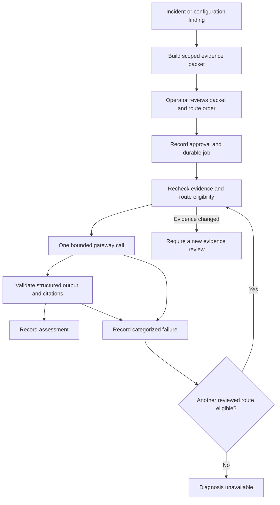

# Evidence-based diagnosis

An operator can request an AI assessment from an incident or configuration finding. The application assembles an inspectable evidence packet, sends it through explicitly reviewed OmniRoute routes, and records cited hypotheses, missing information and suggested next steps.

Diagnosis does not create an approved maintenance action. A runbook mentioned by a model is a candidate; preparing a typed plan requires the device's current configuration snapshot, qualification and verification policy.

## Operator workflow

1. Add an OmniRoute connection in Settings, using its OpenAI-compatible API base (including `/v1` where applicable), pinned address and credential reference.
2. Add explicit provider/model routes. Record the expected response identifiers, provider free-tier terms, gateway/account qualification and review expiry. Approve each route after reviewing its details.
3. Open an incident or configuration finding and select **Prepare diagnosis**. Inspect the affected devices, observations, source times, known gaps and exact outgoing packet.
4. Confirm **Send reviewed evidence**. Approval covers the packet and ordered route revisions; it expires after ten minutes. Up to three eligible routes are selected by priority, with lower numbers first and record ID breaking ties.
5. Read the assessment and its evidence citations. The interface separates possible explanations, alternatives, missing information and physical inspection or configuration review suggestions. Model confidence is self-reported, not a calibrated probability.

The packet contains up to 12 recent results for the incident's measurement policy, or four recent normalized configuration fact records for the finding's device. It includes accepted device identities, reviewed connections within the affected scope, and selected measurement limits. It does not infer missing physical paths. Raw configurations, arbitrary device output, private keys and connector credentials are not included. Additional redaction is applied to allowlisted text.

The exact packet remains in request history. New observations, changed accepted identities, changed settings or evidence ageing can make it stale. Historical assessments remain readable and are marked accordingly. The model's citations are checked for membership and fresh support; their presence does not prove that the explanation is correct.

## Free-provider routing

Each route requires an operator-verified dedicated gateway configuration and upstream account that cannot fall back to paid service. The application records this qualification; **it does not currently inspect or provision the gateway's administrative configuration or verify upstream billing entitlements automatically**. Route eligibility expires within 30 days and must be reviewed again. Paused routes require a new reviewed route record. A gateway quarantine requires fixing and requalifying the connection, then preparing new route records.

Do not qualify a route solely from the gateway's `auto/*:free` selector or a zero response-cost header. OmniRoute documents that an empty filtered auto pool can fall back to its full pool, and zero reported cost can also mean an unpriced model. These behaviors are described in the upstream [Auto-Combo routing reference](https://github.com/diegosouzapw/OmniRoute/blob/release/v3.8.52/docs/routing/AUTO-COMBO.md) and [API reference](https://github.com/diegosouzapw/OmniRoute/blob/release/v3.8.52/docs/reference/API_REFERENCE.md).

The application rejects routing aliases such as `auto` and `combo`, sends one exact model per call, and handles rollover itself. Gateway cache and memory injection are disabled per request. Expected provider/model response headers, zero reported cost and no gateway fallback are required. Unexpected or missing identity/cost metadata quarantines the gateway connection and stops the request, including rollover to other routes. These response checks detect violations after a request; the qualified gateway and account restrictions are the prerequisite that prevents paid routing before the request.

No local inference or paid route is configured by default. An empty installation has no routes and cannot send a diagnosis. Availability, quotas and model suitability must be qualified against the actual provider accounts before commissioning.

## Requests and interruptions



- At most three calls per request, one per selected route. Each call has a 60-second total deadline, 3,000 requested output tokens, a 64 KB response limit and no redirect following. Output validation limits the diagnosis content to 32 KB.
- HTTP 429 respects an integer Retry-After value, bounded to one minute–24 hours; otherwise the cooldown is five minutes. HTTP 402 uses a one-hour cooldown. Authentication and route identity/cost failures quarantine the gateway and stop rollover.
- At most four unexpired requests may be pending. Requests for the same finding are separated by at least one minute.
- PostgreSQL records the call intent before HTTP dispatch. Repeated Temporal delivery does not replay an in-progress or completed request. The scheduler marks expired queued/running requests interrupted after their five-minute deadline. The operator can prepare a new request after an unknown outcome.
- Cancellation prevents further rollover and publication of an assessment. It cannot retract evidence already sent or guarantee cancellation at the provider.
- Model text and upstream error bodies that fail validation are discarded. History records bounded reason codes, route references and times. Credentials do not enter Temporal arguments or results.

Monitoring and deterministic configuration review continue independently when no AI route is available.

## Verification and current limits

Behavior tests cover packet scope, stale inputs, review/start separation, route cooldowns, unknown citations, out-of-scope suggestions, invalid or sensitive output, cancellation and interruption. HTTP tests exercise pinned destinations, error classification and route/cost mismatch detection. Browser tests exercise provider review and the complete evidence-to-assessment interaction.

The optional Temporal contract uses real PostgreSQL, Temporal and HTTP with a controlled gateway endpoint:

```sh
RUN_TEMPORAL_CONTRACT=1 .venv/bin/pytest -q tests/test_diagnosis.py::test_temporal_diagnosis_with_real_gateway_http
```

This verifies workflow integration; it is not live free-provider qualification. Two real eligible providers, account restrictions and rollover remain deployment acceptance requirements. Broader topology context, diagnosis quality evaluations against reviewed incidents and preparation of actionable parameters from fresh configuration snapshots remain development work.
