# Measurement configuration

The Checks workspace connects accepted inventory to recurring, source-bound observations. Each policy starts paused. An operator reviews the path, thresholds and traffic budget before enabling its schedule.

## Configure a path

1. Accept the source and destination identities through inventory review. Include the observation host as a probe or server with its actual interface address.
2. Open **Network → Checks → Verify a source**. Choose the observation host and its reviewed address. The observation worker checks local interface assignment; this step sends no destination traffic.
3. Create a check. Select an explicit destination address, interval, freshness limit and check parameters. Loss and latency thresholds require an operator-supplied limit.
4. Select **Review and start**. Inspect the exact source, destination, traffic budget and limits. Confirm the review to start the recurring schedule.
5. Inspect results and their observation windows. **Run now** uses the same approved cadence; **Pause** stops new collection. Editing saves a paused draft that requires another review.

## Available checks

| Check | Collection | Result |
|---|---|---|
| H01 Reachability | 1–10 source-bound ICMP echoes, one per second | Loss against the accepted limit, with replies and median RTT |
| H02 Latency distribution | Rolling ICMP observations within the selected window | Median, p95, p99 and RTT spread after at least 100 replies |
| H03 Packet loss | Source-bound ICMP echoes | Lost replies divided by transmitted packets |
| H04 TCP | One source-bound connection to port 22, 53, 80 or 443 | Connection failure, or application health unknown after connection success |
| H04 HTTP/HTTPS | One GET to the reviewed address and path, with expected Host/SNI | Expected status response; HTTPS additionally requires certificate validation |
| H04 SSH | Protocol identification read from port 22 | A valid SSH version 2 banner; no login or forwarding-health claim |

HTTP redirects are not followed. Configure a read-only health endpoint; a successful status check establishes that endpoint's response, not every function of the application. SSH banners establish protocol availability rather than device identity or authorization.

Local measurement supports the observation worker's current Linux network namespace. Device-native probes, remote probe registration and explicit VRF selection remain in development. Controller-origin results describe that path and do not represent traffic sourced by a switch.

## Review and collection

```mermaid
flowchart LR
    Inventory[Accepted identities] --> Source[Worker verifies local source]
    Source --> Draft[Paused policy]
    Draft --> Review[Path, limits and traffic budget]
    Review --> Approval[Exact review approval]
    Approval --> Queue[Durable scheduled run]
    Queue --> Guard[Recheck source and accepted path]
    Guard --> Collect[Bounded observation]
    Collect --> Evidence[Timestamped evidence and result]
    Evidence --> Incident[Independent-window correlation]
```

Verification records the active interface, address and worker boot/network-namespace identity. Moving the worker, restarting its host, changing its namespace or changing the accepted path requires renewed source verification and measurement review. Updating an observation timestamp alone does not change accepted identity.

Queued runs expire instead of sending an accumulation of late tests after an outage. A completed run is returned on repeated delivery. A running attempt retains its lease; a replacement run prevents a late attempt from publishing a current result. Pausing during collection invalidates that result, although traffic already in progress may finish.

One measurement at a time may touch a given source or destination identity, with a shared limit of 20 active measurements. A busy slot records a coverage gap and reschedules without sending traffic. ICMP operations have a 23-second process timeout; application response reads have a 10-second deadline and 4 KiB response budget.

## Distributions and incidents

H02 retains at most 100 observation chunks, each with at most ten replies. Evidence outside the configured window is discarded from the rolling calculation, while the original evidence records remain available. A gap larger than twice the schedule interval starts a new series. A revised policy starts a separate distribution.

The dashboard distinguishes a fresh result, a stale observation, an unavailable measurement and a paused schedule. Missing source capability or a failed source bind cannot establish a destination failure.

Three independent failing windows open an incident; three passing windows resolve it. Repeated or out-of-order source timestamps do not advance the streak. H02 distributions sharing observations count as one window until the next non-overlapping distribution is available. These semantics avoid treating the same packet samples as repeated confirmation.

## Verification

- API workflow tests cover verification requests, exact approval, collection, history and pause.
- Collection tests cover stale jobs, changed identities, worker binding, concurrent budgets, duplicate delivery and rolling evidence.
- Service tests cover pinned destinations, expected responses, certificate rejection, response limits and deadlines.
- The opt-in Temporal contract runs real source verification and loopback ICMP through the workflow and activity worker.
- Browser tests cover review controls, schedule creation, source verification, history, and desktop/mobile layout using API fixtures.
